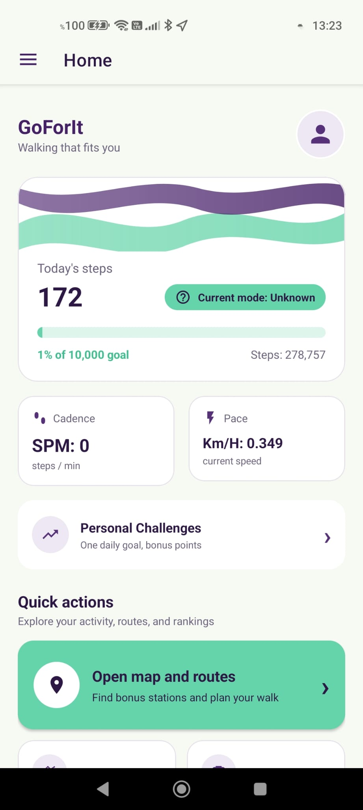
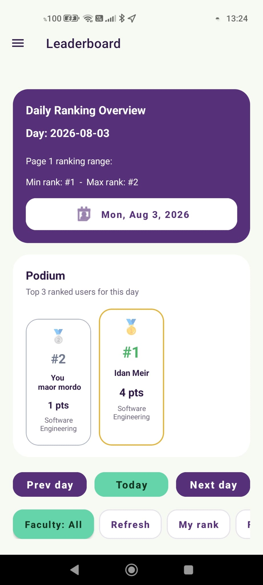
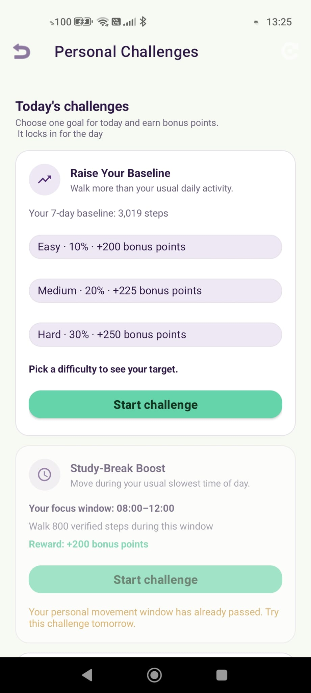
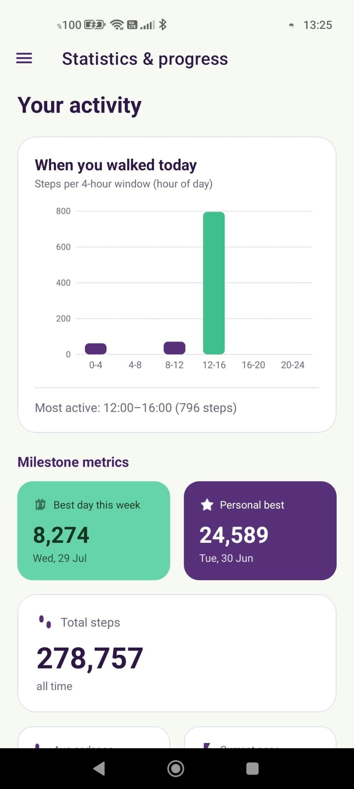
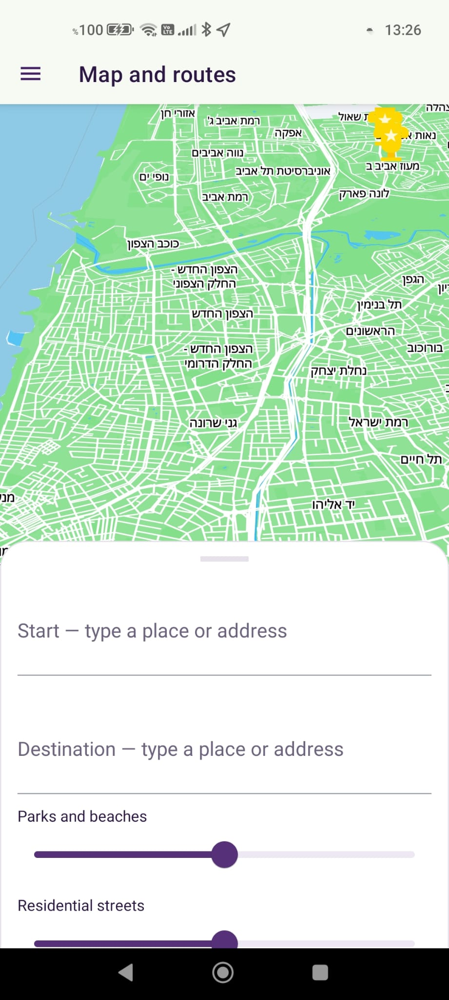
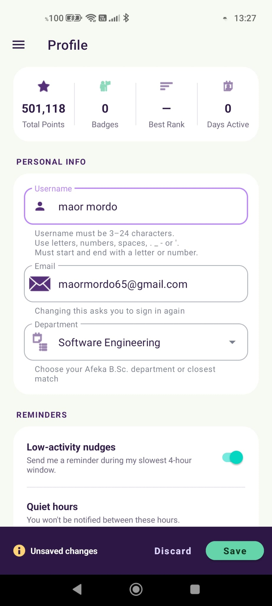
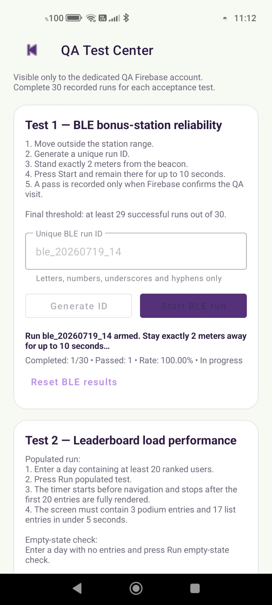

# GoForIt 🏃‍♂️

A native Android app (Kotlin) that turns walking around a college campus into a game.

It counts your steps with a custom accelerometer algorithm, gives bonus points for walking on campus, ranks students and faculties on daily leaderboards, hands out personal challenges, and includes a fully offline map and walking-route planner for Israel. All scoring happens on a Firebase backend, so the phone only measures and displays.

Engineering final project by **Maor Mordo & Idan Meir**.

---

## Contents

- [What it does](#what-it-does)
- [Screenshots](#screenshots)
- [How it fits together](#how-it-fits-together)
- [Step counting](#step-counting)
- [Staying alive in the background](#staying-alive-in-the-background)
- [Uploading steps](#uploading-steps)
- [Points and leaderboards](#points-and-leaderboards)
- [Campus and beacon bonuses](#campus-and-beacon-bonuses)
- [Beacon hardware (Raspberry Pi 5)](#beacon-hardware-raspberry-pi-5)
- [Personal challenges](#personal-challenges)
- [Anti-cheat](#anti-cheat)
- [Offline maps and routes](#offline-maps-and-routes)
- [Backend](#backend)
- [Screens](#screens)
- [QA tools](#qa-tools)
- [Permissions](#permissions)
- [Code map](#code-map)
- [Project structure](#project-structure)
- [Building and running](#building-and-running)
- [Design principles](#design-principles)

---

## What it does

| Feature | Summary |
|---|---|
| **Step counting** | Custom zero-crossing algorithm over accelerometer data, with motion-mode detection (walking, running, cycling, driving, stationary), cadence estimation, and a hardware-sensor fallback for battery-saver mode. → [`StepCounterZC.kt`][stepcounter] |
| **Always-on tracking** | A foreground service plus a heartbeat, a watchdog, a restart worker, and a boot receiver, so tracking survives crashes, reboots, and Android 12–14 background restrictions. → [`StepService.kt`][stepservice] |
| **Server-side scoring** | Steps upload in six 4-hour buckets per day. The server computes points (`steps / 100` plus bonuses), freezes daily leaderboards, and aggregates faculty standings. → [`index.ts`][functions] |
| **Campus bonuses** | Steps inside the college polygon earn extra points on top of their normal value. Physical BLE beacons (Raspberry Pi 5) award a station bonus once a day. → [`CollegeZoneChecker.kt`][collegezone], [`BleAdvertScanService.kt`][blescan] |
| **Personal challenges** | Server-generated goals (`raise_baseline`, `study_break_boost`, `campus_explorer`) with easy/medium/hard tiers. The client only shows them and lets you accept. → [`PersonalChallengesActivity.kt`][challenges] |
| **Anti-cheat** | Detects clock manipulation and out-of-app edits to the saved step data, and gives each install its own device identity. → [`AntiCheatManager.kt`][anticheat] |
| **Offline maps** | MapLibre map, GraphHopper foot routing, and an H3-indexed POI database — all bundled in the APK. Only place-name autocomplete needs internet. → [`MapAndRoutesActivity.kt`][map] |
| **Notifications** | FCM reminders with per-user quiet hours, sent by a scheduled backend job. → [`firebaseMessagingService.kt`][fcm] |
| **QA console** | A hidden acceptance-test screen, locked to one dedicated tester account. → [`QaActivity.kt`][qaactivity] |

---

## Screenshots

| Steps hub | Leaderboard | Personal challenges | Statistics |
|:--:|:--:|:--:|:--:|
|  |  |  |  |
| Live steps, cadence, speed, today's total, and the way into every other screen | Daily ranking with date picker, paging, "my rank", and faculty standings | Offers with difficulty tiers, countdowns, and progress | Hourly and daily step charts drawn from the local stores |

| Map & routes | Profile | QA console |
|:--:|:--:|:--:|
|  |  |  |
| Offline vector map, autocomplete, preference sliders, and a scenic-detour route | Photo, faculty, quiet hours, timezone, and lifetime stats | The three acceptance tests, tester account only |

---

## How it fits together

```
ANDROID APP (Kotlin)
  Sensors → StepCounterZC → StepBus (StateFlows) → StepRepository → UI
                  ↓
       StepHistoryStore / DailyStepsStore / FourHourBucketsSinceBoot
                  (SharedPreferences)

  StepService (foreground)      → location → CollegeZoneChecker
  BleAdvertScanService (fg)     ← BLE adverts from Raspberry Pi 5 stations
  FourHourUploadWorker          → FirebaseServerApi → Cloud Functions
  AntiCheatManager              → time + data integrity checks
  MapAndRoutesActivity          → MbTilesServer + OfflineRouter + H3OpeningScorer
                          │
                          ▼
FIREBASE BACKEND (TypeScript)
  Callables:  register, profile, quiet hours, device trust,
              upload, bonus, challenges
  Scheduled:  finalizeDay (00:30), dispatchNotificationJobs (every 15 min),
              finalizeMonth
  Firestore:  users/{uid}/daily/{dayKey}
              users/{uid}/bonus_visits/{dayKey}
              leaderboards_daily/{dayKey}/entries
              leaderboards_daily/{dayKey}/faculties
              bonus_stations, notification_jobs

BONUS STATIONS (Raspberry Pi 5, Python)
  ble_broadcaster.py under systemd → advertises "RPi5 Beacon" + 0xFFFF payload
```

**Step data path:** [`StepService`][stepservice] runs [`StepCounterZC`][stepcounter], which publishes to [`StepBus`][stepbus] (state flows for steps, cadence, mode, speed, sensor stats). [`StepRepository`][steprepo] exposes that as `LiveData`, and the ViewModels and fragments render it.

Package root is `com.example.goforitGit`, organized by feature: `core.service`, `core.data`, `core.util`, `feature.map`, `feature.leaderboard`, `feature.challenges`, `feature.auth`, `feature.profile`, `feature.statistics`, `feature.steps`, `feature.qa`, `navigation`, `tracking_lifecycle`.

---

## Step counting

[`StepCounterZC`][stepcounter] (~1,160 lines) is the core of the app — a singleton `SensorEventListener` that detects steps from zero crossings in the vertical component of acceleration.

- A small state machine validates each candidate step by amplitude and period. Samples are kept in `recentStepsCsv` as `timeMs:periodS:vRatio:amp`.
- Motion mode is one of `UNKNOWN`, `STATIONARY`, `STANDING_STILL`, `WALKING`, `RUNNING`, `CYCLING`, `DRIVING`. Steps only count in plausible modes, and mode changes go through `applyModeWithHysteresis(...)` so the label doesn't flicker.
- Cadence (steps per minute) and the actual sensor sampling rate are estimated continuously.
- In battery-saver mode it falls back to the hardware `TYPE_STEP_COUNTER` sensor, with filters that drop suspicious bursts — for example tilting or spinning the phone while standing still.
- The saved total is loaded on the first `getInstance()` call, even if `start()` is never called.

**Where step data is saved** (all `SharedPreferences`, deliberately simple):

| Store | File | What it holds |
|---|---|---|
| [`StepHistoryStore`][stephistory] | `stepzc_prefs` | The counter's source of truth: total steps, recent samples, last-save time, campus-bonus sync counters. |
| [`DailyStepsStore`][dailysteps] | — | One highest-total-per-day value, used for "best day" and weekly stats. |
| [`FourHourBucketsSinceBoot`][buckets] | — | Splits the since-boot sensor count into six 4-hour buckets, handling reboots and day rollover (keeps today and yesterday). |

[`StepBus`][stepbus] is a tiny global object of `MutableStateFlow`s that keeps the counter independent of the UI.

---

## Staying alive in the background

Keeping a foreground service running on modern Android was the hardest part of the project, so the design tackles it head-on:

- [**`StepService`**][stepservice] — foreground service for step counting and fused location. On Android 14+ it downgrades its service *type* when started from the background without `ACCESS_BACKGROUND_LOCATION`, because `type=LOCATION` is rejected there. Writes a heartbeat every ~30 s through [`TrackingHeartbeat`][heartbeat].
- [**`TrackingHealthWorker`**][healthworker] — runs every 15 minutes. If the heartbeat is stale, it enqueues the restart worker.
- [**`TrackingRestartWorker`**][restartworker] — a one-shot expedited worker that calls `setForeground(...)`. Because it is itself briefly a foreground service, it is allowed to start other foreground services on Android 12+ — the only reliable background restart path. It calls `TrackingServiceManager.ensureTrackingRunning(...)`.
- [**`TrackingServiceManager`**][svcmanager] — the single place that starts and stops tracking ([`StepService`][stepservice] + [`BleAdvertScanService`][blescan]) and schedules the health worker. State lives in [`TrackingPrefs`][trackprefs].
- [**`BootReceiver`**][bootreceiver] — on boot or app update, just hands off to the restart worker. (Direct-boot support was removed on purpose: counting needs an unlocked user anyway.)
- [**`TrackingPermissions`**][perms] / [**`OnboardingPrefs`**][onboardprefs] — the runtime-permission chain and first-run state used by [`MainActivity`][mainactivity].

Worst-case recovery takes one health-worker cycle (~15 minutes). That's acceptable because the hardware counter and [`FourHourBucketsSinceBoot`][buckets] keep accumulating in the meantime.

---

## Uploading steps

The day (`Asia/Jerusalem`) is split into six intervals: `0 = 00–04`, `1 = 04–08`, … `5 = 20–24`.

1. [`FourHourUploadScheduler`][uploadsched] schedules [`FourHourUploadWorker`][uploadworker] shortly after each boundary.
2. The worker reads the finished bucket, skips it if already sent (a "sent" prefs file), and calls the [`uploadStepInterval`][functions] callable with `(dayKey, intervalIndex, stepsTotal, sessionId)`.
3. The `00:05` run also retries *yesterday's* bucket 5, which is missed if the phone was off overnight.
4. The server saves buckets in `users/{uid}/daily/{dayKey}` (`stepsByInterval[6]`, `uploadedMask`, `totalSteps`), recomputes points, and updates cumulative totals and the live leaderboard.

A day is complete when `uploadedMask == 0b111111`.

---

## Points and leaderboards

- **Base points:** `calcStepPoints(totalSteps) = floor(totalSteps / 100)` — one point per 100 steps.
- **Daily points:** base points + `bonusPoints` (campus and beacon bonuses).
- [**`finalizeDay`**][functions] runs at `00:30` daily. It walks all users, freezes yesterday's rankings into `leaderboards_daily/{dayKey}/entries`, builds per-faculty rows ([`FacultyStanding`][faculty]: rank, total points, total steps, bonus points, member count, average points), and schedules the next day's reminders.
- [**`finalizeMonth`**][functions] produces monthly aggregates.

On the client, [`LeaderboardActivity`][leaderboard] loads one page of entries at a time, can show any past `dayKey`, and has a faculty view backed by [`FacultyStandingAdapter`][facultyadapter]. Screen state survives rotation through [`LeaderboardViewModel`][lbvm]. Tapping a competitor opens [`CompetitorProfileActivity`][competitor], which reads a sanitized profile via `getPublicUserProfile`.

---

## Campus and beacon bonuses

**Campus steps**

[`CollegeZoneChecker`][collegezone] loads `assets/college_polygon.json` (GeoJSON, `[lon, lat]` order) and answers point-in-polygon queries by ray casting, with a small boundary tolerance. While [`StepService`][stepservice] gets location fixes inside the polygon, qualifying steps pile up in [`StepHistoryStore`][stephistory]. The client periodically calls [`syncCollegeAreaSteps`][functions], and the server adds **1 bonus point per 100 qualified campus steps** (`COLLEGE_AREA_STEPS_PER_BONUS_POINT = 100`) on top of the steps' normal value — so a campus step is worth roughly twice a normal one.

The bonus is computed from the *cumulative* qualified total rather than each delta, which keeps re-uploads idempotent and stops rounding from drifting across many small syncs.

> An earlier version gave a flat 10 points per campus step, which made one campus step worth 1,000 ordinary ones and flattened the ranking. Lower the divisor to make campus time more rewarding, raise it to make it gentler.

**BLE bonus stations**

[`BleAdvertScanService`][blescan] is a foreground scanner looking for Raspberry Pi 5 beacons (manufacturer ID `0xFFFF`, device name `RPi5 Beacon`). It alternates between burst and balanced scan modes, restarts stale scans with a watchdog, and reacts to Bluetooth being turned on or off. On a match it calls [`recordBonusVisit(stationId)`][functions]; the server looks the station up in `bonus_stations/{stationId}`, awards its configured `pointsValue`, and writes the visit to `users/{uid}/bonus_visits/{dayKey}` so it can only happen once a day.

The beacons themselves are in [`Raspberry_Pi_5_Files/`][rpidir] — see the section below.

---

## Beacon hardware (Raspberry Pi 5)

A bonus station is a Raspberry Pi 5 running a small Python advertiser. It never accepts connections; the payload rides in the advertisement packet itself, so the phone only has to scan.

```text
BLE Advertisement
├── Local Name: RPi5 Beacon
├── TX Power: included
└── Manufacturer Specific Data
    ├── Manufacturer ID: 0xFFFF
    └── Data: UTF-8 message, max 23 bytes   e.g. "bonus station"
```

The message doubles as the station ID: [`BleAdvertScanService`][blescan] reads those bytes and passes them to `recordBonusVisit`, which looks for a matching document in `bonus_stations`.

| File | Role |
|---|---|
| [`ble_broadcaster.py`][rpiscript] | Registers the advertisement with BlueZ through Bluezero and holds a GLib loop open so it stays live. Name, manufacturer ID, and default message are constants at the top. |
| [`myAppBLE.service`][rpiservice] | systemd unit that starts the advertiser after `bluetooth.target` and restarts it if it dies, so a station comes back on its own after a power cut. |
| [`startScriptBLE.sh`][rpistart] | Optional shell wrapper. The service calls the Python file directly, so this isn't used by default. |
| [`RPI_BLE_INSTALL.md`][rpiguide] | Full install guide: system packages, the `/opt/ble-venv` virtual environment, BlueZ experimental advertising, verification with nRF Connect, service management, and troubleshooting. |

Rough shape of a station setup — the guide has the details:

```bash
sudo apt install -y bluetooth bluez python3-venv python3-dev \
    libcairo2-dev libgirepository1.0-dev libdbus-1-dev libglib2.0-dev pkg-config
sudo python3 -m venv /opt/ble-venv
/opt/ble-venv/bin/pip install pycairo PyGObject dbus-python bluezero
cp ble_broadcaster.py /home/raspberrypi/Desktop/
sudo cp myAppBLE.service /etc/systemd/system/
sudo systemctl enable --now myAppBLE.service
```

Two things that cost time when they go wrong:

- `adv.manufacturer_data(id, bytes)` is a **method call** in this Bluezero version. Assigning to it instead creates a plain Python attribute, and the beacon then advertises with no manufacturer data at all — visible in a scanner, useless to the app.
- The phone and the Pi must agree on the manufacturer ID. It's `0xFFFF` on both sides; a scanner showing the company as `N/A` is expected for that test ID and doesn't mean the payload is missing.

---

## Personal challenges

Defined in [`Personalchallengemodels.kt`][challengemodels] and shown by [`PersonalChallengesActivity`][challenges].

| Type | Goal | Reward |
|---|---|---|
| `raise_baseline` | Beat your 7-day campus baseline by 10% / 20% / 30% (easy / medium / hard) | 200 / 225 / 250 |
| `study_break_boost` | 800 steps during a study break | 200 |
| `campus_explorer` | 1,200 campus steps plus one bonus-station visit | 200 |

Every one of those numbers lives in [`index.ts`][functions] only. Targets, baselines, progress, rewards, and completion are never recalculated on the phone, and progress comes from data the server already trusts (`collegeAreaQualifiedSteps` and verified bonus visits). The only action that changes anything is accepting a challenge (`acceptPersonalChallenge`), which the server validates and freezes. Parsing is defensive: a malformed payload falls back to safe defaults instead of crashing.

Client entry points are [`FirebaseServerApi.getMyPersonalChallengesResult()`][api] and `acceptPersonalChallengeResult()`.

---

## Anti-cheat

[`AntiCheatManager`][anticheat] is a facade over two independent detectors. Both only *read* the counter's prefs; neither ever modifies [`StepCounterZC`][stepcounter].

[**`TimeIntegrityMonitor`**][timemon] — spots system-clock tampering by comparing the user-changeable wall clock (`System.currentTimeMillis`) against the monotonic `SystemClock.elapsedRealtime` within one boot session. Divergence beyond normal NTP drift means tampering. It also flags a saved `lastSaveMs` that sits in the future, which means the clock was rewound between sessions. States: `OK`, `FIRST_RUN`, `REBOOT`, and tamper states with counters.

[**`DataIntegrityMonitor`**][datamon] — spots edits to `stepzc_prefs` made outside the app (root tools, ADB restore, prefs editors) using an HMAC-SHA256 tag over the step values. The key lives in the Android Keystore (`goforit_stepdata_hmac_v1`, sign/verify only), so even root can't forge a tag. Legitimate in-app writes re-sign automatically via `startMonitoring()`. A missing tag file alongside existing data also counts as tampering.

`snapshot()` returns both reports, so upload paths can hold back totals they don't trust.

[`DeviceIdentity`][deviceid] gives each install a random UUID plus a readable device name. The backend exposes matching [`checkDeviceTrust` / `releaseDeviceTrust`][functions] callables for binding an account to one device; reinstalling produces a fresh identity on purpose.

---

## Offline maps and routes

The `feature.map` package gives a complete offline walking-route experience for Israel.

| Component | Role |
|---|---|
| [`MapAndRoutesActivity`][map] | The map screen: start/destination autocomplete, preference sliders, bottom sheet, route layers, 3D buildings, live location. |
| [`MbTilesServer`][mbtiles] | A small NanoHTTPD server on port 8080 serving vector tiles from `assets/israel.mbtiles` (auto-detects TMS y-flip). |
| [`GhGraphInstaller`][ghinstaller] / [`GraphDataInstaller`][graphinstaller] | Unzip the bundled GraphHopper foot graph into app storage. |
| [`OfflineRouter`][router] | Loads the graph and computes offline foot routes. `RoutePrefs`, in the same file, carries the slider settings and extra-distance budget. |
| [`PoiDbInstaller`][poidb] / [`PoiRepository`][poirepo] | Install and query the SQLite POI database (H3-indexed, with a lat/lon fallback), bucketed by category. |
| [`H3OpeningScorer`][h3] | Scores possible detours using Uber H3 grid disks: finds POI-rich neighboring cells inside a bearing cone and distance budget, then inserts the best one into the route. |
| [`GeocoderApi`][geocoder] | The only online piece — Komoot Photon autocomplete, biased to Israel, Hebrew names where OSM has them. |
| [`IsraelBounds`][bounds] | Camera and bounds constraints. |
| [`RoutePlanner`][routeplanner] | Empty placeholder, reserved for future orchestration. |

The sliders let you trade distance for pleasantness: how much you want parks, quiet residential streets, or busy areas, plus how many extra kilometres you're willing to walk for it.

---

## Backend

[`functions/src/index.ts`][functions] (~2,640 lines, TypeScript, Cloud Functions v2, region `us-central1`, Luxon for time, default timezone `Asia/Jerusalem`).

**Auth trigger:** `onAuthUserCreate` creates the `users/{uid}` document.

**Callable functions**

| Function | Purpose |
|---|---|
| `registerFcmToken` | Save the device's FCM token. |
| `getMyProfile` / `updateMyProfile` | Read and update your own profile (name, faculty, timezone). |
| `getPublicUserProfile` | Sanitized profile for competitor screens. |
| `updateQuietHours` | Set the notification quiet window (default 22:00–08:00). Changing it resets learned reminder times. |
| `checkDeviceTrust` / `releaseDeviceTrust` | Bind an account to one device identity, or release it. |
| `uploadStepInterval` | Write one 4-hour bucket. Idempotent per `sessionId`; recomputes daily points and updates cumulative totals and the live leaderboard. |
| `recordBonusVisit` | Award a BLE station visit, once per day, validated against `bonus_stations`. Has a separate QA-only branch that logs evidence without awarding points. |
| `syncCollegeAreaSteps` | Credit campus steps from the cumulative qualified total. |
| `getMyPersonalChallenges` / `acceptPersonalChallenge` | Serve and accept challenge offers. |

**Scheduled jobs**

| Function | Schedule | Purpose |
|---|---|---|
| `finalizeDay` | `30 0 * * *` | Freeze yesterday's leaderboard and faculty standings, schedule reminders. |
| `dispatchNotificationJobs` | `*/15 * * * *` | Send up to 50 due jobs (`PENDING`, `sendAt <= now`) via FCM, honoring quiet hours. |
| `finalizeMonth` | monthly | Monthly aggregation. |

On the client, [`FirebaseServerApi`][api] (a Kotlin `object`) wraps email/password auth and every callable, plus profile-image upload to Firebase Storage and helpers for the current `dayKey` and interval index. [`firebaseMessagingService`][fcm] shows incoming reminders on a high-importance `reminders` channel and respects the Android 13+ `POST_NOTIFICATIONS` permission.

---

## Screens

| Screen | What it shows |
|---|---|
| [`LoginActivity`][login] / [`RegisterActivity`][register] | Email/password auth. |
| [`MainActivity`][mainactivity] | Navigation-drawer host and owner of the permission onboarding chain. Shows a tracking status chip on the Steps destination. |
| [`StepsFragment`][stepsfragment] + [`StepViewModel`][stepvm] | The real hub: live step count, cadence (SPM), speed, today's total, your avatar, and buttons into Map, Leaderboard, Statistics, and Profile. |
| [`LeaderboardActivity`][leaderboard] (+ [adapter][lbadapter], [entry][lbentry], [view model][lbvm]) | Daily rankings with paging, date selection, and faculty standings. |
| [`CompetitorProfileActivity`][competitor] | Another user's public profile. |
| [`ProfileActivity`][profile] | Photo, username, faculty, quiet hours, timezone, and lifetime stats. |
| [`StatisticsActivity`][stats] + [`HourlyStepsChartView`][chartview] | Custom-drawn hourly and daily charts from the local stores. |
| [`PersonalChallengesActivity`][challenges] | Challenge cards with countdowns, status pills, and the accept flow. |
| [`QaActivity`][qaactivity] | Hidden acceptance-test console. |
| [`HomeFragment`][home] / [`GalleryFragment`][gallery] / [`SlideshowFragment`][slideshow] | The remaining drawer destinations, still on the Android Studio template. |

Layouts follow a `feature_*` / `nav_*` naming convention — for example [`feature_steps_fragment.xml`][layoutsteps] and [`feature_leaderboard_activity.xml`][layoutleaderboard]. [`mobile_navigation.xml`][navgraph] drives the drawer.

---

## QA tools

The console implements the three acceptance tests from the engineering report:

1. **BLE reliability** — repeated runs entering a station's range, stored as immutable evidence documents (no points awarded).
2. **Leaderboard performance** — measures how long the leaderboard takes to render fully.
3. **Recoverability** — records the step count, forces a crash, and compares the count after restart.

- [`QaAccess`][qaaccess] — a hard gate: the QA UI only opens when both the Firebase email (`goforit.qa@test.com`) and the UID match the dedicated tester account. [`QaActivity`][qaactivity] re-checks in `onCreate` and `onStart`, so an explicit Intent can't get in either. The QA branch of `recordBonusVisit` additionally requires the `qaTester: true` custom claim.
- [`grantQaTester.cjs`][grantqa] / [`seedLeaderboardQa.cjs`][seedqa] — Node scripts using Firebase Admin to grant that claim and seed leaderboard test data.

---

## Permissions

Declared in [`AndroidManifest.xml`][manifest], scoped by SDK version where relevant.

- **Motion/health:** `ACTIVITY_RECOGNITION`, `BODY_SENSORS` (+ background), `HIGH_SAMPLING_RATE_SENSORS`
- **Location:** `ACCESS_FINE_LOCATION`, `ACCESS_COARSE_LOCATION`, `ACCESS_BACKGROUND_LOCATION`
- **Bluetooth:** `BLUETOOTH_SCAN`, `BLUETOOTH_CONNECT` (API 31+); legacy `BLUETOOTH` / `BLUETOOTH_ADMIN` (≤ API 30)
- **Foreground services:** `FOREGROUND_SERVICE` plus the typed variants `LOCATION`, `HEALTH`, `DATA_SYNC`, `CONNECTED_DEVICE`
- **Other:** `INTERNET`, `ACCESS_NETWORK_STATE`, `RECEIVE_BOOT_COMPLETED`, `POST_NOTIFICATIONS`, `REQUEST_IGNORE_BATTERY_OPTIMIZATIONS`

Registered components: 10 activities, [`StepService`][stepservice], [`BleAdvertScanService`][blescan], [`firebaseMessagingService`][fcm], [`BootReceiver`][bootreceiver], and WorkManager's foreground-service override.

---

## Code map

The files worth opening first, in rough order of importance.

| File | Size | Why it matters |
|---|--:|---|
| [`StepCounterZC.kt`][stepcounter] | ~1,160 lines | The step-detection algorithm and motion classifier. |
| [`index.ts`][functions] | ~2,640 lines | Every scoring rule, challenge definition, and scheduled job. |
| [`BleAdvertScanService.kt`][blescan] | ~920 lines | Beacon scanning, scan-mode cycling, watchdog. |
| [`MapAndRoutesActivity.kt`][map] | ~860 lines | Offline map UI and route rendering. |
| [`StepService.kt`][stepservice] | ~850 lines | Foreground service, location fixes, campus detection. |
| [`MainActivity.kt`][mainactivity] | ~840 lines | Drawer host and permission onboarding chain. |
| [`QaActivity.kt`][qaactivity] | ~670 lines | The three acceptance tests. |
| [`FirebaseServerApi.kt`][api] | — | Every client→server call in one place. |
| [`AntiCheatManager.kt`][anticheat] | — | Entry point to both integrity monitors. |
| [`FourHourBucketsSinceBoot.kt`][buckets] | — | The bucketing logic behind uploads. |
| [`ble_broadcaster.py`][rpiscript] | — | What a bonus station actually transmits. |

---

## Project structure

```
app/src/main/java/com/example/goforitGit/
├── core/
│   ├── service/                StepService, BleAdvertScanService
│   ├── data/
│   │   ├── StepsData/          StepBus, StepRepository, StepHistoryStore,
│   │   │                       DailyStepsStore
│   │   └── FirebaseData/       FirebaseServerApi, firebaseMessagingService
│   └── util/
│       ├── StepsUtils/         StepCounterZC, CollegeZoneChecker
│       ├── FourHourBuckets/    FourHourBucketsSinceBoot, Scheduler, Worker
│       ├── TrackingLifecycle/  Trackingheartbeat, TrackingPrefs,
│       │                       TrackingServiceManager, Trackingpermissions,
│       │                       Onboardingprefs
│       ├── AntiCheat/          AntiCheatManager, TimeIntegrityMonitor,
│       │                       DataIntegrityMonitor
│       ├── DeviceSecurity/     DeviceIdentity
│       └── Receivers/          BootReceiver
├── tracking_lifecycle/         TrackingHealthWorker, Trackingrestartworker
├── feature/
│   ├── auth/ui/                LoginActivity, RegisterActivity
│   ├── map/
│   │   ├── ui/                 MapAndRoutesActivity
│   │   └── data/               OfflineRouter, MbTilesServer, H3OpeningScorer,
│   │                           PoiRepository, PoiDbInstaller, GhGraphInstaller,
│   │                           GraphDataInstaller, GeocoderApi, IsraelBounds,
│   │                           RoutePlanner
│   ├── leaderboard/
│   │   ├── ui/                 LeaderboardActivity, LeaderboardAdapter,
│   │   │                       LeaderboardViewModel, Facultystandingadapter,
│   │   │                       CompetitorProfileActivity
│   │   └── model/              LeaderboardEntry, Facultystanding
│   ├── challenges/
│   │   ├── ui/                 PersonalChallengesActivity
│   │   └── model/              Personalchallengemodels
│   ├── statistics/ui/          StatisticsActivity, HourlyStepsChartView
│   ├── profile/ui/             ProfileActivity
│   ├── steps/                  ui/StepsFragment, viewmodel/StepViewModel
│   ├── home, gallery, slideshow/  Fragment + ViewModel (template screens)
│   └── qa/                     QaAccess, ui/QaActivity
└── navigation/                 MainActivity

app/src/main/res/               layout/, drawable/, menu/, navigation/, values/
functions/src/index.ts          All Cloud Functions
tools/                          grantQaTester.cjs, seedLeaderboardQa.cjs
Raspberry_Pi_5_Files/           Beacon advertiser, systemd unit, install guide
docs/screenshots/               Screenshots used in this README
```

---

## Building and running

**You'll need**

- Android Studio with a recent AGP, and Kotlin. The root [`build.gradle.kts`][gradle] applies `com.google.gms.google-services 4.4.4` and `com.chaquo.python 17.0.0` (Chaquopy, used at build time).
- A Firebase project with Email/Password auth, Firestore, Cloud Functions (`us-central1`), Storage (profile images), and FCM. Put your `google-services.json` in `app/`.
- Node.js for the `functions/` workspace (Functions v2 + `luxon`). Deploy with `firebase deploy --only functions`.

**Bundled assets** (large binaries, not in this source snapshot)

| Asset | Purpose |
|---|---|
| `assets/israel.mbtiles` | Vector tiles for the offline map |
| `assets/gh/israel_foot_graph_1.zip` | GraphHopper foot-routing graph |
| `assets/poi_h3.db` (or a DB under `assets/poi/`) | POI database |
| `assets/college_polygon.json` | Campus geofence |

**Main libraries:** MapLibre GL, GraphHopper core, Uber H3, NanoHTTPD, Play Services Location, WorkManager, Firebase (Auth / Firestore / Functions / Storage / Messaging), Material Components, AndroidX Navigation.

**Bonus-station hardware:** Raspberry Pi 5 units advertising BLE manufacturer data under company ID `0xFFFF` with the device name `RPi5 Beacon`. Everything needed to build one is in [`Raspberry_Pi_5_Files/`][rpidir], with step-by-step instructions in [`RPI_BLE_INSTALL.md`][rpiguide].

**To run:** build and install, register or log in, then walk through the permission onboarding (activity recognition → location → background location → notifications → battery-optimization exemption). Tracking then starts as a persistent foreground service.

---

## Design principles

- **The server decides.** Points, leaderboards, challenge math, and bonus validation all happen in [Cloud Functions][functions]. The client uploads raw measurements and renders whatever comes back.
- **Uploads are safe to retry.** Session IDs, per-interval sent flags, the `uploadedMask` bitmask, and cumulative-total bonus math make every upload idempotent and resumable.
- **One restart path.** Boot, watchdog, and crash recovery all go through the same foreground-elevated [`TrackingRestartWorker`][restartworker].
- **Detectors stay out of the way.** Anti-cheat modules only read the counter's data, so the counting code stays independent of them.
- **Offline first.** Tiles, routing graph, and POIs ship inside the APK. Only name autocomplete needs a connection.

<!-- ─────────────────────── link definitions ─────────────────────── -->

[stepcounter]: app/src/main/java/com/example/goforitGit/core/util/StepsUtils/StepCounterZC.kt
[collegezone]: app/src/main/java/com/example/goforitGit/core/util/StepsUtils/CollegeZoneChecker.kt
[stepbus]: app/src/main/java/com/example/goforitGit/core/data/StepsData/StepBus.kt
[steprepo]: app/src/main/java/com/example/goforitGit/core/data/StepsData/StepRepository.kt
[stephistory]: app/src/main/java/com/example/goforitGit/core/data/StepsData/StepHistoryStore.kt
[dailysteps]: app/src/main/java/com/example/goforitGit/core/data/StepsData/DailyStepsStore.kt
[buckets]: app/src/main/java/com/example/goforitGit/core/util/FourHourBuckets/FourHourBucketsSinceBoot.kt
[uploadsched]: app/src/main/java/com/example/goforitGit/core/util/FourHourBuckets/FourHourUploadScheduler.kt
[uploadworker]: app/src/main/java/com/example/goforitGit/core/util/FourHourBuckets/FourHourUploadWorker.kt
[stepservice]: app/src/main/java/com/example/goforitGit/core/service/StepService.kt
[blescan]: app/src/main/java/com/example/goforitGit/core/service/BleAdvertScanService.kt
[api]: app/src/main/java/com/example/goforitGit/core/data/FirebaseData/FirebaseServerApi.kt
[fcm]: app/src/main/java/com/example/goforitGit/core/data/FirebaseData/firebaseMessagingService.kt
[heartbeat]: app/src/main/java/com/example/goforitGit/core/util/TrackingLifecycle/Trackingheartbeat.kt
[trackprefs]: app/src/main/java/com/example/goforitGit/core/util/TrackingLifecycle/TrackingPrefs.kt
[svcmanager]: app/src/main/java/com/example/goforitGit/core/util/TrackingLifecycle/TrackingServiceManager.kt
[perms]: app/src/main/java/com/example/goforitGit/core/util/TrackingLifecycle/Trackingpermissions.kt
[onboardprefs]: app/src/main/java/com/example/goforitGit/core/util/TrackingLifecycle/Onboardingprefs.kt
[healthworker]: app/src/main/java/com/example/goforitGit/tracking_lifecycle/TrackingHealthWorker.kt
[restartworker]: app/src/main/java/com/example/goforitGit/tracking_lifecycle/Trackingrestartworker.kt
[bootreceiver]: app/src/main/java/com/example/goforitGit/core/util/Receivers/BootReceiver.kt
[anticheat]: app/src/main/java/com/example/goforitGit/core/util/AntiCheat/AntiCheatManager.kt
[timemon]: app/src/main/java/com/example/goforitGit/core/util/AntiCheat/TimeIntegrityMonitor.kt
[datamon]: app/src/main/java/com/example/goforitGit/core/util/AntiCheat/DataIntegrityMonitor.kt
[deviceid]: app/src/main/java/com/example/goforitGit/core/util/DeviceSecurity/DeviceIdentity.kt
[map]: app/src/main/java/com/example/goforitGit/feature/map/ui/MapAndRoutesActivity.kt
[mbtiles]: app/src/main/java/com/example/goforitGit/feature/map/data/MbTilesServer.kt
[ghinstaller]: app/src/main/java/com/example/goforitGit/feature/map/data/GhGraphInstaller.kt
[graphinstaller]: app/src/main/java/com/example/goforitGit/feature/map/data/GraphDataInstaller.kt
[router]: app/src/main/java/com/example/goforitGit/feature/map/data/OfflineRouter.kt
[poidb]: app/src/main/java/com/example/goforitGit/feature/map/data/PoiDbInstaller.kt
[poirepo]: app/src/main/java/com/example/goforitGit/feature/map/data/PoiRepository.kt
[h3]: app/src/main/java/com/example/goforitGit/feature/map/data/H3OpeningScorer.kt
[geocoder]: app/src/main/java/com/example/goforitGit/feature/map/data/GeocoderApi.kt
[bounds]: app/src/main/java/com/example/goforitGit/feature/map/data/IsraelBounds.kt
[routeplanner]: app/src/main/java/com/example/goforitGit/feature/map/data/RoutePlanner.kt
[login]: app/src/main/java/com/example/goforitGit/feature/auth/ui/LoginActivity.kt
[register]: app/src/main/java/com/example/goforitGit/feature/auth/ui/RegisterActivity.kt
[leaderboard]: app/src/main/java/com/example/goforitGit/feature/leaderboard/ui/LeaderboardActivity.kt
[lbadapter]: app/src/main/java/com/example/goforitGit/feature/leaderboard/ui/LeaderboardAdapter.kt
[lbvm]: app/src/main/java/com/example/goforitGit/feature/leaderboard/ui/LeaderboardViewModel.kt
[lbentry]: app/src/main/java/com/example/goforitGit/feature/leaderboard/model/LeaderboardEntry.kt
[faculty]: app/src/main/java/com/example/goforitGit/feature/leaderboard/model/Facultystanding.kt
[facultyadapter]: app/src/main/java/com/example/goforitGit/feature/leaderboard/ui/Facultystandingadapter.kt
[competitor]: app/src/main/java/com/example/goforitGit/feature/leaderboard/ui/CompetitorProfileActivity.kt
[challenges]: app/src/main/java/com/example/goforitGit/feature/challenges/ui/PersonalChallengesActivity.kt
[challengemodels]: app/src/main/java/com/example/goforitGit/feature/challenges/model/Personalchallengemodels.kt
[stats]: app/src/main/java/com/example/goforitGit/feature/statistics/ui/StatisticsActivity.kt
[chartview]: app/src/main/java/com/example/goforitGit/feature/statistics/ui/HourlyStepsChartView.kt
[profile]: app/src/main/java/com/example/goforitGit/feature/profile/ui/ProfileActivity.kt
[stepsfragment]: app/src/main/java/com/example/goforitGit/feature/steps/ui/StepsFragment.kt
[stepvm]: app/src/main/java/com/example/goforitGit/feature/steps/viewmodel/StepViewModel.kt
[home]: app/src/main/java/com/example/goforitGit/feature/home/ui/HomeFragment.kt
[gallery]: app/src/main/java/com/example/goforitGit/feature/gallery/ui/GalleryFragment.kt
[slideshow]: app/src/main/java/com/example/goforitGit/feature/slideshow/ui/SlideshowFragment.kt
[qaaccess]: app/src/main/java/com/example/goforitGit/feature/qa/QaAccess.kt
[qaactivity]: app/src/main/java/com/example/goforitGit/feature/qa/ui/QaActivity.kt
[mainactivity]: app/src/main/java/com/example/goforitGit/navigation/MainActivity.kt
[manifest]: app/src/main/AndroidManifest.xml
[layoutsteps]: app/src/main/res/layout/feature_steps_fragment.xml
[layoutleaderboard]: app/src/main/res/layout/feature_leaderboard_activity.xml
[navgraph]: app/src/main/res/navigation/mobile_navigation.xml
[functions]: functions/src/index.ts
[grantqa]: tools/grantQaTester.cjs
[seedqa]: tools/seedLeaderboardQa.cjs
[gradle]: build.gradle.kts
[rpidir]: Raspberry_Pi_5_Files
[rpiscript]: Raspberry_Pi_5_Files/ble_broadcaster.py
[rpiservice]: Raspberry_Pi_5_Files/myAppBLE.service
[rpistart]: Raspberry_Pi_5_Files/startScriptBLE.sh
[rpiguide]: Raspberry_Pi_5_Files/RPI_BLE_INSTALL.md
